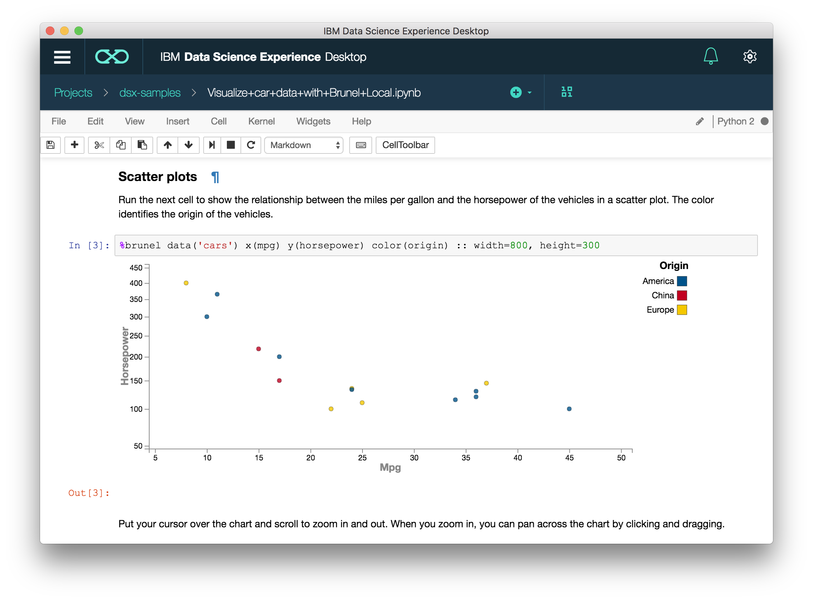

# IBM Data Science Experience Desktop
IBM Data Science Experience Desktop was built for those who want to download and play locally. Analyze, learn, and build with the tools you love, right on your desktop.

## Download
* [Mac](https://github.com/IBMDataScience/DSx-Desktop/releases/download/1.2.4/IBM_DSX_Desktop-1.2.4.dmg)
* [Windows](https://github.com/IBMDataScience/DSx-Desktop/releases/download/1.2.4/IBM_DSX_Desktop-1.2.4.exe)
* [Linux](https://github.com/IBMDataScience/DSx-Desktop/releases/download/1.2.4/ibm-dsx-desktop.AppImage)

## Features
* The same Jupyter notebooks you know and love with the building blocks you need for Python, R, and Scala. 
* Easily access Apache Spark from your desktop so you can create and learn on the go. 
* Built-in tutorial notebooks to help jump start your learning experience.
* Support for RStudio IDE and Zeppelin notebooks, to meet your various needs.

## Documentation
Documentation for DSX Desktop can be found [here](https://content-dsxdesktop.mybluemix.net/).

## Something wrong?
Submit an [issue](https://github.com/IBMDataScience/DSx-Desktop/issues/new).
